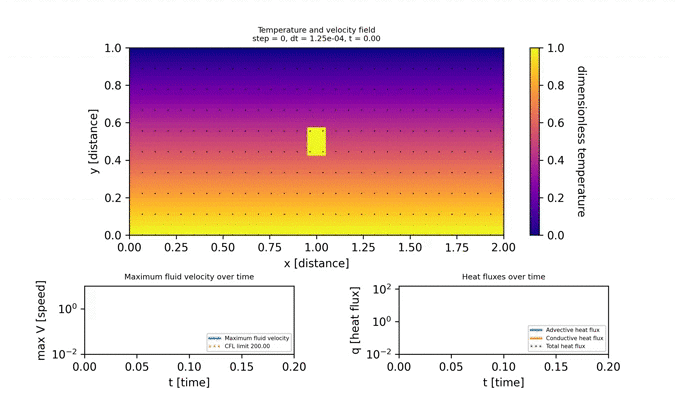

A finite difference code to simulate 2D advection-convection, or Rayleigh-Bernard, systems.
Has the dependencies:

1. Python 3.7
2. Numpy
3. SciPy
4. Matplotlib

Run the code by changing the configuration values in `main.py` and entering the following on your terminal:

```
python main.py
```

Make a video out of the results by going into the `simulations` directory and using ffmpeg like this:

```
ffmpeg -framerate 5 -pattern_type glob -i '*.png' \
  -c:v libx264 -r 30 -pix_fmt yuv420p out.mp4
```

An example simulation with an unstable initial condition and 3:1 aspect ratio (which will favour 3 convection cells) is given below. This is the parameters currently set in `main.py`.


